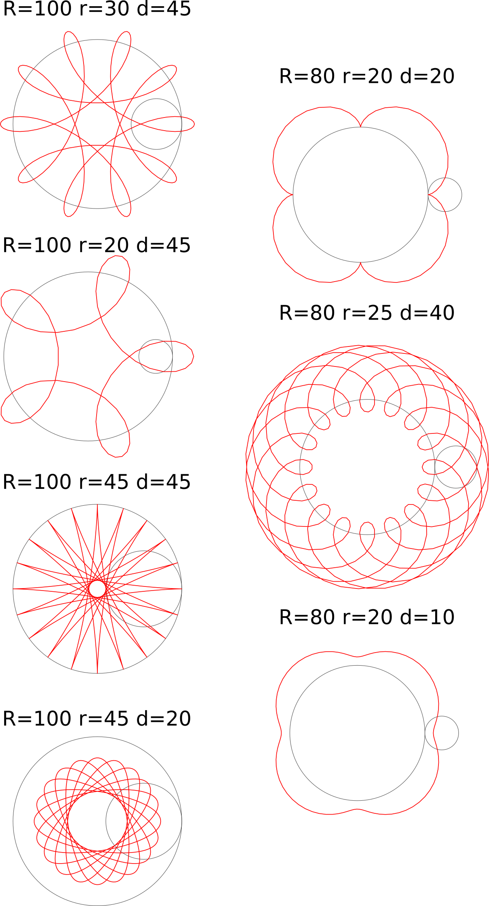
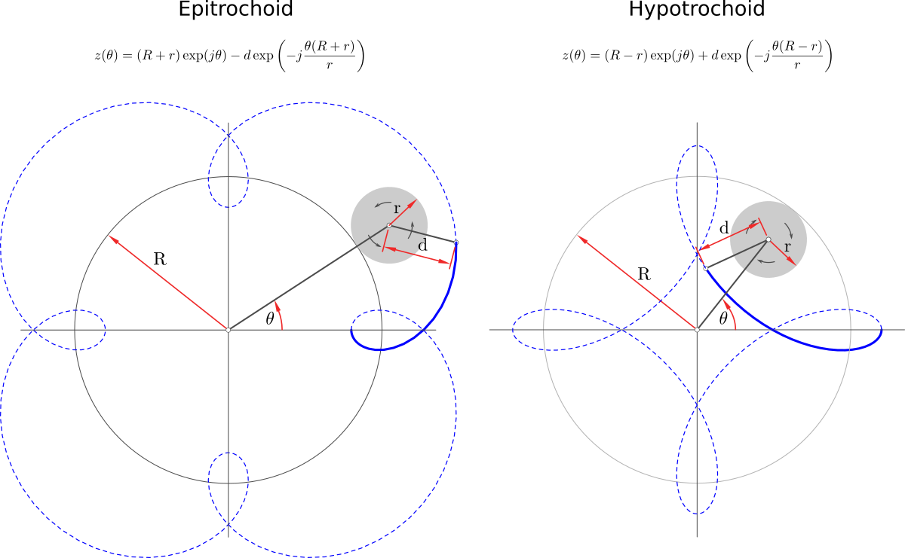
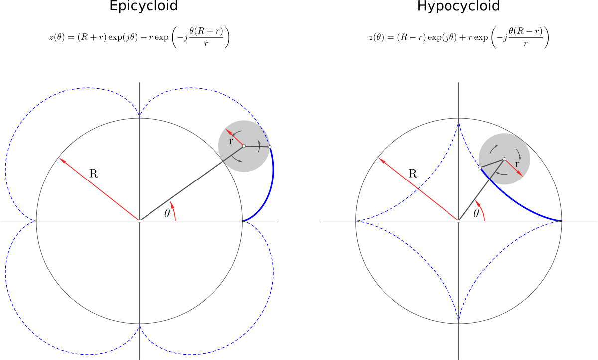
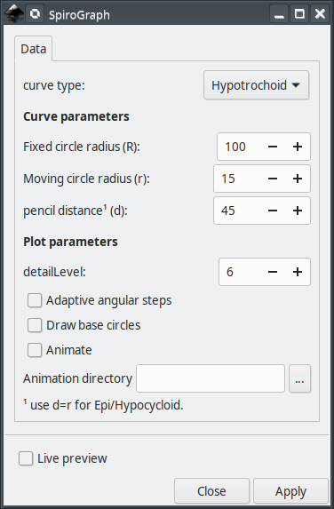
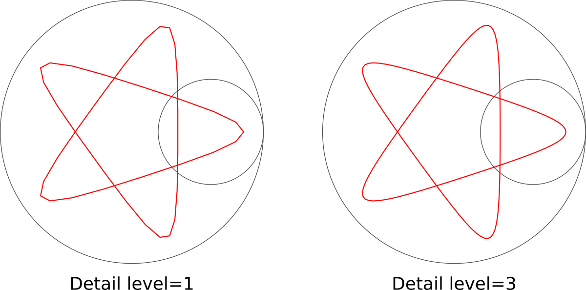

# Spirograph

This extension will assist you creating spirograph plots in [Inkscape](https://inkscape.org/).




## Main features
The main features of this extension are

- Hypocycloid, Epicycloid, Hypotrochoid, Epitrochoid plots
- Export the svg step by step of the plot to facilitate creating animations

## Current version

Compatibility table

|  Inkscape        |  Spirograph       | inkscapeMadeEasy | Receive updates?|
|------------------|-----------------|------------------|-----------------|
|       1.0        | 1.0 (latest)    |   1.0 (latest)   | YES             |
| 0.48, 0.91, 0.92 | -               |   -              | -               |


**Latest version:** The latest version of **Spirograph** is **1.0**. This version is compatible with Inkscape 1.0 and up only. It is **incompatible** with older Inkscape versions!

# Installation and requirements

Installation procedures for latest versions is described below.

## Requirements

- You will need [inkscapeMadeEasy](https://github.com/fsmMLK/inkscapeMadeEasy) plugin installed. Check the compatibility table above to know the version you need.

## Installation procedure (v1.0 only)

**Spirograph** was developed using Inkscape 1.0 in Linux (Kubuntu 18.04). It should work in different OSs too as long as all requirements are met.

1. Install [inkscapeMadeEasy](https://github.com/fsmMLK/inkscapeMadeEasy), **version 1.0** (latest). Follow the instructions in the manual page. **Note:** LaTeX text is not used in this extension.

2. **Spirograph** installation

    1. Go to Inkscape's extension directory with a file browser. Your inkscape extension directory can be accessed by opening Inkscape and selecting ``Edit > Preferences > System``. Look for the item **User Extensions**  field. There is a button on the right of the field  that will open a file explorer window in that specific folder.

    2. Create a subfolder in the extension directory with the name ``spirograph``. **Important:**  Be careful with upper and lower case letters. You must write as presented above.

    3. Download **Spirograph** files and place them inside the directory you just created.

       You don't have to copy all files from Github. The files you will need are inside the ``latest`` folder. In the end you must have the following files and directories in your Inkscape extension directory.

       **LaTeX users:** You can add macros to ``inkscapeMadeEasy/basicLatexPackages.tex``. The same macros will be accessible by all plugins that employ inkscapeMadeEasy.

        ```
        inkscape
         ┣━━extensions
         ┋   ┣━━ inkscapeMadeEasy      <-- inkscapeMadeEasy folder
             ┃    ┣━━ inkscapeMadeEasy_Base.py
             ┃    ┣━━ inkscapeMadeEasy_Draw.py
             ┃    ┣━━ inkscapeMadeEasy_Plot.py
             ┃    ┗━━ basicLatexPackages.tex
             ┃
             ┣━━ textext               <-- texText folder (if you installed textText)
             ┃    ┋
             ┃
             ┣━━ spirograph        <-- Spirograph folder
             ┋    ┣━━ spirograph.inx
                  ┗━━ spirograph.py
        
        NOTE: You might have other sub folders inside the extensions directory. They don't interfere with the plugin.
        ```
        
# Equations

[Spirographs](https://en.wikipedia.org/wiki/Spirograph) are famous toys capable of creating roulette curves on a piece of paper, called [Hypotrochoid](https://en.wikipedia.org/wiki/Hypotrochoid) and [Epitrochoid](https://en.wikipedia.org/wiki/Epitrochoid). This inkscape extension allows the creating of these families of curves.

They are constructed by a point attached to a circle of radius *r* rolling around the outside (Epitrochoid) or inside (Hypotrochoid) of a fixed circle of radius *R*, where the point is at a distance *d* from the center of the exterior circle.

Epitrochoid | Hypotrochoid
- | - 
 | 

The special case when *d=r*, we have the Epi/Hypocycloid

Epicycloid | Hypocycloid
- | - 
 | 

The equations that describe the curves are presented in the figure below. They can be written in terms of complex numbers ( *x=Re(z)* and *y=Im(z)* )





In order to close the curve (if possible), it is necessary *N=lcm(r,R)/R* turns over the circle *R*, give by


where *lcm(r,R)* is the [least common multiple](https://en.wikipedia.org/wiki/Least_common_multiple) between *r* and *R*. 

# Usage

## Data



**Curve type:** You can choose Epitrochoid or Hypotrochoid.

### Curve parameters section

**Fixed circle radius (R):** Radius of the fixed circle. See [Equations section](#Equations).

**Rolling circle radius (r):** Radius of the moving circle. See [Equations section](#Equations).

**Pencil distance(d):** Distance between the position of the pencil and the center of the rolling circle. See [Equations section](#Equations). Use *d=r* to get Epicycloid or Hypocycloid.

### Plot parameters section

*Detail level:* Defines the number of points used to trace the curve.



**Draw base circles:** Add the two circles in the initial position. See figure above.

**Animate:** export a sequence of svg for animation purposes. See [Bash script to create the animations](#Theory) one option Linux only) to create the animation after exporting the SVGs. The code has limited animation features. When activated, the plot will show the circle rolling and 3 curves plotted at the same time as one animation example. See [Examples section](#Examples) for the result. Unfortunately, if you want to create different animations, you will need to change the source code yourself. Hopefully the code is understandable for those with some python knowledge.

**Animation directory:** Folder where the exported svgs will be stored.


# Bash script to create the animations

This is the script I use to create the animation. This is exclusive for Linux. Similiar script could be created for other OSs. You will need  pdfcrop, ImageMagick to use the script. See [Examples section](#Examples) for one example


```bash

#! /bin/bash

#requires the follogins packages:  pdfcrop, imagemagick


rm tempSizes.txt

if [ $# -lt 1 ]
  then
  echo "Wrong number of arguments.
 svg2gif <file1.svg> <file2.svg> ..."
  exit
fi

FILE_DIR=$(dirname $1)


echo "converting to pdf and finding the bounding box..."
for FILE in "$@"; do
  if [ ${FILE: -4} == ".svg" ]; then
    FILE_PREFIX=$(basename $FILE .svg)
    FILE_DIR=$(dirname $FILE)
    FILE_PDF=${FILE_DIR}'/'${FILE_PREFIX}.pdf

    inkscape --vacuum-defs --export-type="pdf" $FILE   # export para eps
    
    # encontra o bounding box e salva em um arquivo de texto
    # source: https://tex.stackexchange.com/questions/166758/how-do-i-make-pdfcrop-output-all-pages-of-the-same-size
    pdfcrop --verbose $FILE_PDF temp.pdf| grep '^%%HiResBoundingBox: ' | cut -d' ' -f2- >>tempSizes.txt
    rm temp.pdf
  fi
done

# source: https://tex.stackexchange.com/questions/166758/how-do-i-make-pdfcrop-output-all-pages-of-the-same-size
#find bounding box of all images
BBOX=$(less tempSizes.txt | tr '.' ',' | datamash -t' ' min 1 min 2 max 3 max 4 | tr ',' '.')
rm tempSizes.txt

echo "cropping PDFs..."
#crop pdfs and convert to png
for FILE in "$@"; do
  if [ ${FILE: -4} == ".svg" ]; then
    FILE_PREFIX=$(basename $FILE .svg)
    FILE_DIR=$(dirname $FILE)
    FILE_PDF=${FILE_DIR}'/'${FILE_PREFIX}.pdf
    pdfcrop --bbox "$BBOX" $FILE_PDF
  fi
done

echo "converting to PNG..."
mogrify -density 500 -resize 800 -flatten -format png ${FILE_DIR}/out*-crop.pdf
echo "gerando GIF..."
convert -delay 5 -dispose previous -loop 0  ${FILE_DIR}/outSVG_*.png  ${FILE_DIR}/animated.gif
rm outSVG*.pdf outSVG*.png


```


# Observations

 - The axes will be created in the center of your screen.

# Examples


The image below is an animation composed by 3 simultaneous curves, converted to gif (external tools).


